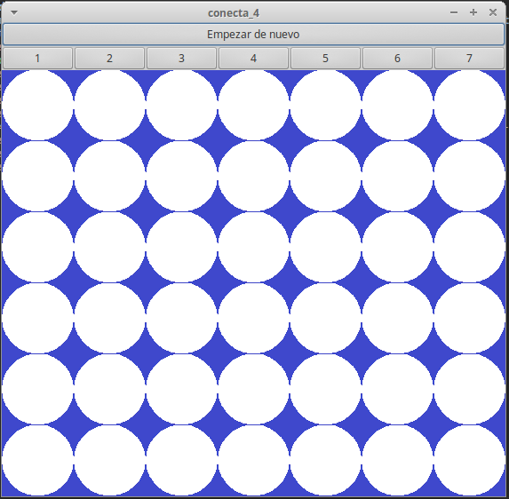

# Game "Conecta4" (Connect 4)
## Juego "Conecta4"
========

A gtk2 based game emulating the classic Connect 4

Un juego basado en gtk2 que emula el clásico Conecta 4

## Author - Autor
Luis Zepeda - https://github.com/luis-zepeda

## Screenshoot - Captura de pantalla
--------

## How to play - Como jugar
--------

After compiling the game, you can run it with the command:

    $ ./Conecta4

The program tries to resemble the classic board with a grid of images
distributed in 7 columns, each one with a button the players can use to put a
checker in the bottom of the column in their corresponding turn.
The game don't automatically finish after the objective has been meet so the
users need to do it manually by pressing the button with the text: "Empezar de
nuevo"

Después de compilar el juego, puedes ejecutarlo mediante el comando:

    $ ./Conecta4

El programa intenta recrear el clásico tablero con una rejilla de imágenes
distribuidas en 7 columnas, cada una con un botón que los jugadores pueden usar
para poder una pieza en el fondo de la columna en su turno correspondiente.
El juego no termina automáticamente una vez que los objetivos se han cumplido
por lo que los usuarios necesitarán hacerlo manualmente presionando el botón con
el texto: "Empezar de nuevo"
